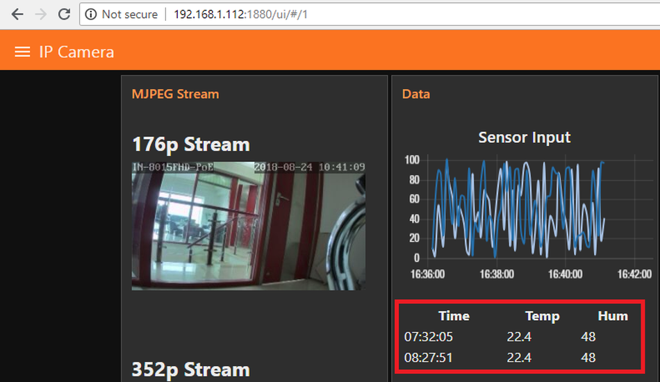

# Using SQLite with Node-RED on Windows

<!-- TOC -->

- [Using SQLite with Node-RED on Windows](#using-sqlite-with-node-red-on-windows)
  - [Installing SQLite](#installing-sqlite)
    - [Creating your first Database](#creating-your-first-database)
  - [Installing SQLite in Node-RED](#installing-sqlite-in-node-red)
    - [INSERT inject node](#insert-inject-node)
    - [SELECT inject node with](#select-inject-node-with)
    - [DELETE inject node as follows](#delete-inject-node-as-follows)
    - [DROP inject node](#drop-inject-node)
  - [Visualizing Data from SQLite in Node-RED Dashboard](#visualizing-data-from-sqlite-in-node-red-dashboard)

<!-- /TOC -->

## Installing SQLite

First scroll down to the newest pre-compiled version for your Operating System [here](https://www.sqlite.org/download.html) and choose the bundle of command-line tools for managing SQLite database files, including the command-line shell program, the sqldiff.exe program, and the sqlite3_analyzer.exe program.

Unzip the folder, rename it something short - e.g. sqlite3 - and copy it to your C:\ partition. Now add the installation path to your system variables and run the __sqlite3__ command to see that it is working:


To exit the SQLite Shell again, type `.quit`


### Creating your first Database

Navigate to the directory you want to store your data and type `sqlite3 mydb.db` and `.databases`:


To add a table, type in the following `create table cameras (id INT primary key);`. This will create a table named __cameras__ with a single (primary) column with the name of __id__ that expects an integer value.


## Installing SQLite in Node-RED

Open the __Manage Palette__ menu inside Node-RED, switch to the __Install__ tab and search for __node-red-node-sqlite__. More information can be found [here](https://flows.nodered.org/node/node-red-node-sqlite). A new node called sqlite should appear on the left under the storage tab. In this flow, you’re going to send 5 SQL queries (CREATE, INSERT, SELECT, DELETE and DROP) to your SQLite database:


Doubleclick the __SQLite Node__ press the Add new sqlitedb button and type in the absolute path to the SQLite Database we created earlier


Configure your CREATE __Inject Node__ as follows:


```sql
CREATE TABLE dhtreadings(id INTEGER PRIMARY KEY AUTOINCREMENT, temperature NUMERIC, humidity NUMERIC, currentdate DATE, currenttime TIME, device TEXT)
```


Repeat this step to create the following :


### INSERT inject node

```sql
INSERT INTO dhtreadings(temperature, humidity, currentdate, currenttime, device) values(22.4, 48, date('now'), time('now'), "manual")
```


### SELECT inject node with

```sql
SELECT * FROM dhtreadings
```


### DELETE inject node as follows

```sql
DELETE from dhtreadings
```


### DROP inject node

```sql
DROP TABLE dhtreadings
```

To save your application, you need to click the __Deploy__ button on the top right corner (`You might have to restart Node-RED`) and your application is saved and ready. Open the debug window and press the first inject node to trigger the CREATE SQL query:


## Visualizing Data from SQLite in Node-RED Dashboard

We are able to visualize the data by using the [dashboard nodes](https://github.com/mpolinowski/nodered-dashboard-getting-started).


Injecting `SELECT * FROM dhtreadings` into our SQLite node gives us an array of records in the response, we can simply use the ui template node to parse the information we want.


For example, we would like to have a table showing the first 2 records, just simply connect the template UI node to the SQLite node:


In the template node, enter the following code:

```html
<table style="width:100%">
  <tr>
    <th>Time</th> 
    <th>Temp</th> 
    <th>Hum</th>
  </tr>
  <tr ng-repeat="x in msg.payload | limitTo:2">
    <td>{{msg.payload[$index].currenttime}}</td>
    <td>{{msg.payload[$index].temperature}}</td> 
    <td>{{msg.payload[$index].humidity}}</td>
  </tr>
</table>
```


This code simply a table in HTML, and places the index, currenttime, temperature and humidity fields from  msg.payload into the appropriate cells of the table using __ng-repeat__ & __limitTo__. Once you deploy the nodes, the UI template node will update the table whenever SELECT * is sent to the SQLite node, and an array of records are returned from the SQLite node to the UI template node. The resulting table would look like this when you hit the URL http://192.168.1.112:1880/ui/:


